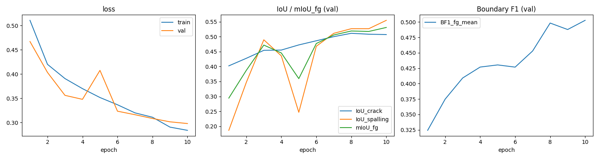
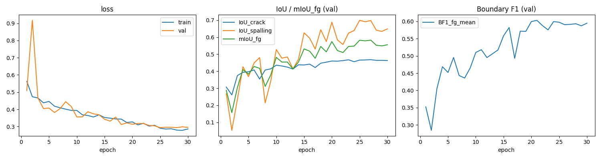

# Step 1 — DeepLabV3+ Formal CNN Baseline

*Date*: 2026-04-09
*Device*: NVIDIA GPU (RunPod)

---

## 1. 实验目的

Step 1 建立正式的 CNN baseline，与 Step 0 (U-Net R34@320 sanity check) 对比，
回答三个问题：

1. **Run A (R50@512)**: 更大 encoder + 更高分辨率 + ASPP → 能带来多大提升？
2. **Run B (R34@320)**: 同分辨率/同 encoder 下，DeepLabV3+ 与 U-Net 架构差异有多大？
3. **BF1 基准**: Boundary F1 在 CNN 上能到什么水平？

---

## 2. 实验配置

| | Run A | Run B |
|---|---|---|
| Run name | `deeplabv3p_r50_512` | `deeplabv3p_r34_320` |
| Encoder | ResNet-50 | ResNet-34 |
| Input size | 512×512 | 320×320 |
| Batch size | 4 | 8 |
| Epochs | 50 | 30 |
| LR | 5e-4 | 1e-3 |
| Scheduler | CosineAnnealingLR | CosineAnnealingLR |
| Optimizer | AdamW (wd=1e-4) | AdamW (wd=1e-4) |
| Loss | CEDiceLoss (0.5 CE + 0.5 Dice) | 同左 |
| CE weights | auto `[0.25, 1.08, 1.71]` | 同左 |
| BF1 tolerance | 2 px | 2 px |
| Data / splits | 1200/150/150, 与 Step 0 完全相同 | 同左 |
| Best ckpt 选法 | 最大 val mIoU_fg | 同左 |

---

## 3. 训练曲线

### Run A (R50@512, 50 epochs)



- Loss 全程平稳下降 (train 0.52→0.19, val 0.45→0.27)，**无 epoch 崩溃**（Step 0
  U-Net 在 epoch 10 有一次 val 崩溃，这里已消失）。
- Crack IoU 0.39→0.54 稳步提升；spalling IoU 0.21→0.59 更快。
- BF1_fg_mean 0.34→0.60 持续上升，末段仍有上升趋势。

### Run B (R34@320, 30 epochs)



- Epoch 2 出现一次 val loss 暴涨 (0.92)，之后立刻恢复，与 Step 0 U-Net 的
  epoch 10 崩溃类似——可能是 320 分辨率 + 较高 LR 在初期的不稳定。
- Spalling IoU 波动较大 (0.05→0.70)，但趋势明确向上。
- BF1_fg_mean 从 0.35→0.60 上升，最终值与 Run A 接近。

---

## 4. Val 关键 epoch

### Run A (R50@512)

| epoch | train_loss | val_loss | IoU_crack | IoU_spalling | mIoU_fg | BF1_fg_mean |
|------:|-----------:|---------:|----------:|-------------:|--------:|------------:|
|  1    | 0.521      | 0.446    | 0.386     | 0.212        | 0.299   | 0.337       |
| 10    | 0.338      | 0.326    | 0.496     | 0.509        | 0.502   | 0.471       |
| 20    | 0.293      | 0.309    | 0.523     | 0.511        | 0.517   | 0.528       |
| **32**| **0.219**  | **0.267**| **0.525** | **0.680**    | **0.602** | 0.533     |
| 40    | 0.205      | 0.272    | 0.539     | 0.588        | 0.564   | 0.576       |
| 50    | 0.191      | 0.272    | 0.539     | 0.588        | 0.563   | 0.595       |

Best = epoch 32 (val mIoU_fg = **0.602**)。后 18 epoch mIoU_fg 在 0.53–0.57 波动
未超越，但 BF1 仍缓慢上升 (0.53→0.60)。

### Run B (R34@320)

| epoch | train_loss | val_loss | IoU_crack | IoU_spalling | mIoU_fg | BF1_fg_mean |
|------:|-----------:|---------:|----------:|-------------:|--------:|------------:|
|  1    | 0.563      | 0.508    | 0.307     | 0.268        | 0.288   | 0.352       |
| 10    | 0.394      | 0.356    | 0.435     | 0.528        | 0.482   | 0.510       |
| 20    | 0.327      | 0.313    | 0.460     | 0.689        | 0.574   | 0.600       |
| **27**| **0.287**  | **0.295**| **0.468** | **0.698**    | **0.583** | 0.592     |
| 30    | 0.286      | 0.295    | 0.463     | 0.649        | 0.556   | 0.595       |

Best = epoch 27 (val mIoU_fg = **0.583**)。

---

## 5. Test Set Final Metrics

### 5.1 Per-class

| class | Run A IoU | Run A Dice | Run B IoU | Run B Dice |
|---|---|---|---|---|
| background | 0.9689 | 0.9842 | 0.9648 | 0.9821 |
| crack | **0.5188** | 0.6832 | 0.4677 | 0.6374 |
| spalling | 0.6610 | 0.7959 | **0.6544** | 0.7911 |

### 5.2 Aggregate

| metric | Run A (R50@512) | Run B (R34@320) |
|---|---|---|
| **mIoU_fg** | **0.5899** | 0.5611 |
| mIoU_all | 0.7162 | 0.6957 |
| pixel_acc | 0.9697 | 0.9657 |
| BF1_crack | 0.6598 | **0.7101** |
| BF1_spalling | 0.4343 | **0.4847** |
| BF1_fg_mean | 0.5470 | **0.5974** |

### 5.3 混淆矩阵 (行=gt, 列=pred)

**Run A (R50@512)**
```
              pred_bg      pred_crack   pred_spalling
gt_bg       36,633,101      624,002       123,365
gt_crack       335,878    1,049,774         7,758
gt_spalling     92,904        6,093       448,725
```

**Run B (R34@320)**
```
              pred_bg      pred_crack   pred_spalling
gt_bg       14,273,700      283,048        45,005
gt_crack       153,156      388,965         2,282
gt_spalling     38,845        4,123       170,876
```

两个 Run 中 crack↔spalling 互相误判均 < 0.5% 前景像素——**类别区分已完全学会，
剩余误差集中在前景 vs 背景的边界定位**。

---

## 6. 三模型横向对比 (含 Step 0 U-Net)

| metric | U-Net R34@320 | DLv3+ R34@320 (B) | DLv3+ R50@512 (A) |
|---|---|---|---|
| IoU_crack | 0.5098 | 0.4677 | **0.5188** |
| IoU_spalling | **0.6808** | 0.6544 | 0.6610 |
| mIoU_fg | **0.5953** | 0.5611 | 0.5899 |
| Dice_crack | 0.6753 | 0.6374 | **0.6832** |
| Dice_spalling | **0.8101** | 0.7911 | 0.7959 |
| pixel_acc | 0.9686 | 0.9657 | **0.9697** |
| BF1_crack | — | **0.7101** | 0.6598 |
| BF1_spalling | — | **0.4847** | 0.4343 |
| BF1_fg_mean | — | **0.5974** | 0.5470 |

### 6.1 关键发现

**发现 1: CNN 架构间差异很小，mIoU_fg 天花板约 0.59–0.60。**

三个模型（两种架构、两种分辨率、两种 encoder）test mIoU_fg 都在 0.56–0.60 之间。
U-Net R34@320 (0.595) 甚至微高于 DeepLabV3+ R50@512 (0.590)，说明仅靠换
encoder/decoder/分辨率很难再涨。**需要 curriculum learning 或 boundary refinement
等新方法突破这个瓶颈。**

**发现 2: 分辨率 320→512 对 crack IoU 提升很小 (+0.009)。**

Crack 是细长结构，直觉上更高分辨率应该帮助很大，但实际提升微乎其微。瓶颈不在
分辨率而在 **segmentation head 对细长结构的边界建模能力**——这正是 boundary
refinement 要解决的。

**发现 3: Spalling 在各模型中都比 crack 更好学。**

Spalling IoU 在三个模型中都在 0.65–0.68，高于 crack 的 0.47–0.52。Spalling 是
大块连通区域，即使在低分辨率下也能被较好捕获。

**发现 4: BF1 跨分辨率不可直接比较。**

Run B (320) 的 BF1 全面优于 Run A (512)，但这是因为 2px tolerance 在不同分辨率下
对应不同的物理距离：
- 320: 2px ≈ 4.0 原始像素 (640/320×2)
- 512: 2px ≈ 2.5 原始像素 (640/512×2)

Run A 面临的边界精度要求实际更严格。**后续实验应在同一分辨率下比较 BF1。**

**发现 5: BF1_spalling (0.43–0.48) 远低于 BF1_crack (0.66–0.71)。**

直觉上 spalling 的大块区域应该更容易定位边界，但结果相反。原因推测：spalling
边界本身模糊（渐变损伤区域），而 crack 边界虽细但对比度清晰。**Boundary
refinement 在 spalling 边界上的改善空间最大。**

---

## 7. 训练稳定性

| | Run A (R50@512) | Run B (R34@320) |
|---|---|---|
| 崩溃事件 | 无 | epoch 2 val_loss 暴涨至 0.92 (自动恢复) |
| 过拟合 | 轻微 (train 0.19 vs val 0.27) | 轻微 (train 0.29 vs val 0.30) |
| 收敛 | epoch 32 后 mIoU plateau，BF1 仍在涨 | epoch 27 后接近收敛 |
| LR schedule | CosineAnnealing 全程平稳 | 同左 |

Run A 在 best epoch (32) 之后 18 个 epoch 里 mIoU_fg 浮动 0.53–0.57，但 BF1
持续从 0.53→0.60——**说明后期学习集中在边界细化而非区域扩展**，佐证了 boundary
refinement 方向的价值。

---

## 8. 总结与下一步

### 8.1 Step 1 结论

| 结论 | 说明 |
|---|---|
| CNN mIoU_fg 天花板 ≈ 0.59–0.60 | 三模型一致，仅靠架构/分辨率无法突破 |
| BF1_fg_mean ≈ 0.55–0.60 | 边界精度的 CNN 上界，为 boundary refinement 提供基准 |
| Crack 瓶颈在边界精度 | 320→512 仅 +0.009 IoU |
| Spalling BF1 改善空间最大 | 0.43–0.48，远低于 spalling IoU 的 0.65–0.68 |
| 类别区分已完全学会 | crack↔spalling 误判 < 0.5%，剩余误差在前景 vs 背景 |

### 8.2 下一步

- **Step 4 (SegFormer-B2@512)**: Transformer backbone 能否突破 CNN 的 0.60 天花板？
  已完成代码（`baseline_segformer/`），RunPod probe 进行中。
  - Run A: plain baseline
  - Run B: DamSegment 官方 Easy→Medium→Hard 静态课程
- 后续 curriculum learning 和 boundary refinement 统一在 **512 分辨率**下进行，
  BF1 才具有跨实验可比性。

---

*产物位置*:

| | Run A | Run B |
|---|---|---|
| 路径 | `baseline_deeplab/runs/deeplabv3p_r50_512/` | `baseline_deeplab/runs/deeplabv3p_r34_320/` |
| 训练产物 | best.pt, last.pt, metrics.csv, curves.png, test_report.txt, samples/ | 同左 |
| Probe (10ep) | `preTest/` | — |
