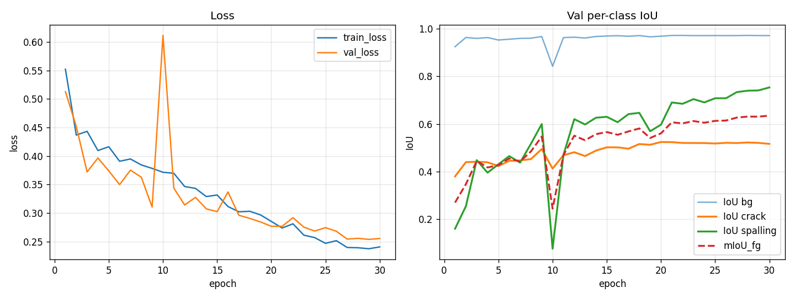

# Step 0 — U-Net Baseline Sanity Check on DamSegment

*Run name*: `unet_r34_ce_dice`
*Date*: 2026-04-09
*Device*: Apple Silicon MPS (PyTorch 2.8.0, smp 0.5.0, albumentations 2.0.8)

---

## 1. 实验目的

本次实验是整个研究（Dynamic Difficulty-Aware Curriculum Learning + Boundary
Refinement for Fine-Grained Crack & Spalling Segmentation on Concrete Dams）的
**Step 0**。目的**不是**刷 SOTA，而是：

1. 验证数据读取、RGB mask → class index 解码正确；
2. 验证 loss / optimizer / augmentation / metric 等组件能正确联动；
3. 验证经典 U-Net 在 DamSegment 上确实能学到两个前景类的轮廓。

只要这三条满足，后续的 curriculum learning 和 boundary refinement 才有意义的
baseline 可以作参照。

---

## 2. 数据集

- **来源**: `Dataset/DamSegment/Damage Segmentaion/{Easy, Medium, Hard}/{Images, Labels/Mask}`
- **总量**: 1500 张 JPG 图像，640×640 RGB；每个难度 500 张
- **类别** (3 类)：
  | id | 名称       | RGB 编码 (阈值 >127) |
  |----|------------|---------------------|
  | 0  | background | (0,0,0)             |
  | 1  | crack      | R 通道高             |
  | 2  | spalling   | B 通道高             |

  解码用通道阈值 (`r>127`, `b>127`)，spalling 覆盖 crack。

### 2.1 Mask overlap 统计

对全体 1200 张训练图像统计：

```
global overlap / foreground = 0.000000
per-image overlap histogram (=0, <=0.1%, <=0.5%, <=2%, >2%) = [1200, 0, 0, 0, 0]
```

**结论**: 数据集里 crack 和 spalling 通道几乎完全不重叠，"spalling 覆盖 crack" 的
策略是无风险的，Step 1 暂不需要从 JSON polygon 重建 mask。

### 2.2 通道顺序验证

`dataset.py --peek` 自动扫描前 5 个带 spalling 的样本，断言 `label==2` 的像素对应
raw mask 的 **蓝通道**高响应、`label==1` 对应**红通道**高响应。全部通过：

```
[peek] channel order OK on 5 spalling samples
```

### 2.3 数据划分 (二级分层 difficulty × has_spalling)

Bucket 大小及其 (train, val, test) 切分 (seed=42)：

```
bucket ('Easy',   False): n=323  -> (259, 32, 32)
bucket ('Easy',   True ): n=177  -> (141, 18, 18)
bucket ('Medium', False): n=406  -> (324, 41, 41)
bucket ('Medium', True ): n=94   -> ( 76,  9,  9)
bucket ('Hard',   False): n=405  -> (325, 40, 40)
bucket ('Hard',   True ): n=95   -> ( 75, 10, 10)
```

合并后的 split 汇总：

| split | n    | crack_only | spalling | 像素占比 bg / crack / spalling |
|-------|------|------------|----------|-------------------------------|
| train | 1200 | 905        | 292      | 0.9522 / 0.0342 / 0.0136      |
| val   | 150  | 113        | 37       | 0.9528 / 0.0354 / 0.0118      |
| test  | 150  | 113        | 37       | 0.9507 / 0.0354 / 0.0139      |

三个 split 里 spalling 的占比保持一致，分层有效。

---

## 3. 方法

| 组件 | 值 |
|---|---|
| Model | `smp.Unet(encoder_name="resnet34", encoder_weights="imagenet", in_channels=3, classes=3)` |
| Input size | 320×320 (原图 640×640 下采样；MPS 上训 640 太慢，先在 320 跑通) |
| Augmentation (train) | `Resize(320) → HFlip(.5) → VFlip(.5) → RandomBrightnessContrast(.3) → Normalize(ImageNet) → ToTensorV2` |
| Augmentation (val/test) | `Resize(320) → Normalize → ToTensorV2` |
| Mask resize 插值 | 仅 `INTER_NEAREST`；transform 后 assert `unique(mask) ⊆ {0,1,2}` |
| Loss | CEDiceLoss = 0.5·weighted CE + 0.5·foreground-only Dice |
| Optimizer | AdamW(lr=1e-3, weight_decay=1e-4) |
| Scheduler | CosineAnnealingLR(T_max=30) |
| Batch size | 8 |
| Epochs | 30 |
| Seed | 42 |
| Best checkpoint 选法 | 最大 `val mIoU_fg` |

### 3.1 CE 类别权重 (自动 vs 手动)

```
raw pixel frequency : bg=0.9522  crack=0.0342  spalling=0.0136
smoothed (1/sqrt(f)): bg=0.2049  crack=1.0808  spalling=1.7143
clipped [0.25, 5.0] : bg=0.2500  crack=1.0808  spalling=1.7143   <-- 实际使用
manual fallback     : bg=0.20    crack=2.00    spalling=3.00
```

本次训练采用**自动**权重。背景权重被 clip 到 0.25 下限，防止背景信号彻底压掉；
spalling 类虽然像素比例最小（1.36%），但 1/√f 平滑后只有 1.71，比手工 fallback 的
3.0 要温和很多。

### 3.2 Dice 处理稀疏类

foreground-only Dice 且 **batch 中不存在的前景类不纳入 mean**，纯背景 batch 的 Dice
项置 0（见 `losses.py`）。这样在小 batch + 稀疏 spalling 的组合下，Dice 项不会剧烈
震荡。

---

## 4. 实现细节

- **BGR ↔ RGB**: `cv2.imread` 默认 BGR，mask 必须显式 `cv2.cvtColor(BGR2RGB)`，否则
  crack / spalling 会被颠倒。已在 `--peek` 模式通过断言验证。
- **通道阈值解码** (`dataset.decode_mask`): `is_crack = r>127`, `is_spalling = b>127`,
  spalling 写在后面以覆盖任何 overlap。
- **每 batch 自检**: dataset 读图后 assert `label.shape == img.shape[:2]` 、`dtype == int64`、
  `unique ⊆ {0,1,2}`；albumentations 之后再 assert 一次。
- **epoch 末打印** 训练集真实 label 像素占比（稳定 `bg=0.9521 crack=0.0343 spalling=0.0136`，
  与 split 统计一致）。
- **best-by-mIoU_fg checkpoint**: 只保留一个 `best.pt`，以 val `mIoU_fg` 为准。
- **MPS 兼容**: 默认设置 `PYTORCH_ENABLE_MPS_FALLBACK=1`；本次训练未触发 CPU 回退。

---

## 5. 结果

### 5.1 训练曲线



见 `curves.png`: loss 单调下降 (除 epoch 10 有一个小震荡后立刻恢复)；crack 的 IoU
从 0.38 → 0.52 平滑上升；spalling 的 IoU 从 0.16 → 0.75 上升 (最快的部分是 epoch
12 之后)；`mIoU_fg` 从 0.27 → 0.635。

### 5.2 Val 关键 epoch

| epoch | train_loss | val_loss | IoU_crack | IoU_spalling | mIoU_fg |
|------:|-----------:|---------:|----------:|-------------:|--------:|
|  1    | 0.552      | 0.513    | 0.380     | 0.161        | 0.270   |
|  5    | 0.416      | 0.374    | 0.424     | 0.431        | 0.427   |
| 10    | 0.372      | 0.612    | 0.413     | 0.077        | 0.245   |
| 15    | 0.332      | 0.302    | 0.502     | 0.630        | 0.566   |
| 20    | 0.285      | 0.277    | 0.524     | 0.597        | 0.561   |
| 25    | 0.247      | 0.274    | 0.518     | 0.708        | 0.613   |
| 30    | 0.240      | 0.255    | 0.517     | 0.753        | **0.635** |

> epoch 10 出现过一次小崩 (val_loss 0.612, spalling IoU 0.077)，但下一 epoch 立刻恢复。
> 推测是 cosine 学习率还在高位时的瞬时抖动，训练曲线整体稳定。

### 5.3 Test set final metrics (best-by-val checkpoint, epoch 30)

| class | IoU | Dice |
|---|---|---|
| background | 0.9677 | 0.9836 |
| crack      | **0.5098** | 0.6753 |
| spalling   | **0.6808** | 0.8101 |
| **mIoU_fg**    | **0.5953** |        |
| mIoU_all   | 0.7194 |        |
| pixel_acc  | 0.9686 |        |

### 5.4 Test 混淆矩阵 (行=gt, 列=pred)

```
            pred_bg      pred_crack   pred_spalling
gt_bg      14,280,389      278,044        43,320
gt_crack      121,733      421,310         1,360
gt_spalling    33,834        4,014       175,996
```

- crack ↔ spalling 之间的误判几乎没有（1,360 + 4,014 ≈ 0.03% 前景像素）——模型没有
  把两类搞混。
- 主要误差来自 crack ↔ bg：22.4% 的 crack gt 被漏判成 bg（细线丢失，和 320 分辨率有关）。
- spalling 有 16.1% gt 被漏判成 bg，但 crack / spalling 之间无串扰。

### 5.5 可视化

`samples/epoch_030.png` (6 张固定 val 样本：2 crack-only / 2 crack+spalling / 2 Hard)
可以直接肉眼看到：

- crack 的细线轮廓已经基本勾勒出来（虽然细处会断）；
- spalling 的块状区域已能相对完整地定位；
- 颜色分配 (crack=red, spalling=blue) 与 gt 对应一致，验证了整个管线的颜色/类别
  对齐没有错位。

额外保留了 `epoch_000_init.png`（训练前）和每 5 个 epoch 的快照，方便逐 epoch 横向
比较学习进度。

---

## 6. Sanity check 结论

| 检查项 | 结果 |
|---|---|
| pipeline 能跑通 (splits / peek / dry-run / 30 ep / test) | ✅ |
| 数据解码正确 (BGR→RGB 断言 + 0 overlap) | ✅ |
| train loss 持续下降不发散 | ✅ (0.55 → 0.24) |
| crack IoU 明显上升 | ✅ (0.38 → 0.52) |
| spalling IoU 未完全塌掉 | ✅ (0.16 → 0.75) |
| 可视化可见 crack 细线 + spalling 块状 | ✅ |
| `mIoU_fg` 作为附加参考 | val 最佳 0.6350 / test 0.5953 |

**Step 0 通过标准的 4 条软指标全部满足。** `mIoU_fg` 的绝对数值（test 0.595）
也远高于最初预期的 0.3 级别 sanity 结果，说明现有 pipeline 很健康，没有引入隐性
bug。

### 6.1 遇到的坑

1. **MPS 上 BatchNorm 统计会偶发不稳定** — epoch 10 出现一次 val_loss 暴涨到 0.612
   的小崩，下一 epoch 自动恢复。影响可以忽略，但在正式 baseline 时建议对 MPS 开
   `torch.backends.mps.deterministic` 并观察是否仍有此现象。
2. **初期 pip 只有 21.2.4，需先升级**；`segmentation-models-pytorch==0.5.0` 首次需要
   下载 `resnet34` 的 ImageNet 权重（已通过 HuggingFace Hub）。
3. **`cv2.imread` 默认 BGR** 是最大的雷点。由 `--peek` 的通道顺序断言排除了这一
   风险，没有在训练里真的踩到。
4. **320×320 resize 对细 crack 不友好** — 混淆矩阵显示 crack 有 22% 像素漏判为 bg，
   肉眼看可视化时也能看到断线。这是 sanity 阶段可接受的代价，但 Step 1 之后应切回
   512 或保留 640。

---

## 7. 下一步 (Step 1 准备)

基于 Step 0 的观察，进入 **Dynamic Difficulty-Aware Curriculum Learning** 时需要
注意：

1. **分辨率**: 320 下细 crack 丢失明显，Step 1 建议切到 **512×512**；如果 MPS 显存
   不够可以把 batch size 从 8 调到 4。
2. **spalling 稀疏**: 尽管 val spalling IoU 已经 0.75，但样本只有 292/1200 (24%)，
   curriculum 的采样策略里应对 `has_spalling` 做 **over-sampling** 或至少保证每个
   batch 至少 1 张 spalling 样本，避免 curriculum 后期再次掉到 epoch 10 那种崩溃。
3. **类权重**: 自动权重 `[0.25, 1.08, 1.71]` 已经足够，不需要切到手工 `[0.2, 2.0, 3.0]`；
   curriculum 阶段若 crack 精度停滞，可以小幅抬高 crack 权重到 1.5 左右而不是 2.0。
4. **Boundary refinement 的意义**: 现在 crack 的 IoU 只有 0.51 但 Dice 0.68，说明大
   部分误差集中在边缘细像素 → 边界细化模块大概率能直接受益。可把当前 crack 的
   `Recall_crack = 421310 / (421310 + 121733) = 0.776`、`Precision = 421310 /
   (421310 + 278044) = 0.602` 作为 Step 2 的 baseline 来对比边界模块带来的提升。
5. **Val 震荡**: epoch 10 的崩溃提示 curriculum 过程中学习率切换 / 难度切换时需要
   warm-up，并把 best checkpoint 保留策略沿用过来。
6. **Confusion matrix**: crack/spalling 互相误判 < 0.03% —— 说明类别区分已经学会，
   剩下的主要是**前景 vs 背景**的细粒度定位问题，这正好是 curriculum + boundary
   refinement 应该重点改善的。

---

*产物位置*:

- 代码: `Codes/baseline_unet/*.py`
- splits: `Codes/baseline_unet/splits/{train,val,test}.txt`
- 训练产物: `Codes/baseline_unet/runs/unet_r34_ce_dice/`
  - `best.pt`, `last.pt`
  - `metrics.csv`, `curves.png`
  - `test_report.txt`
  - `samples/epoch_{000_init, 001, 005, 010, 015, 020, 025, 030}.png`
- 数据 sanity 图: `Codes/baseline_unet/runs/sanity/peek_{00..03}.png`
